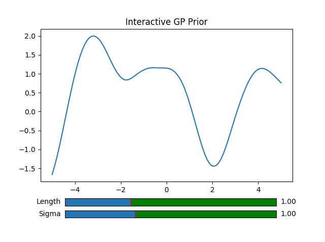
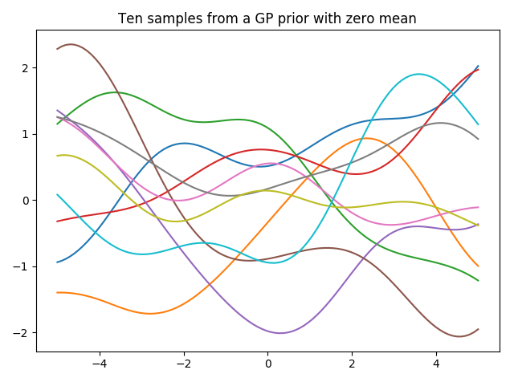
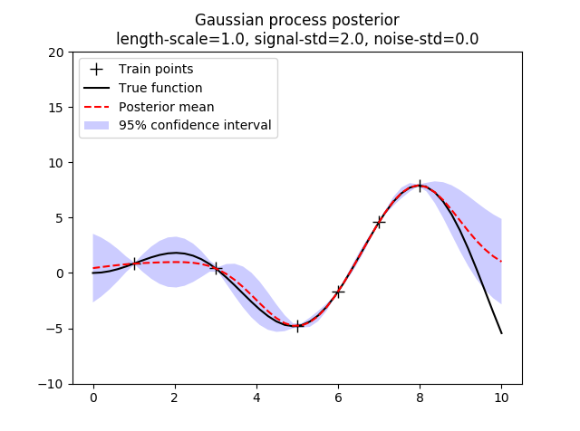
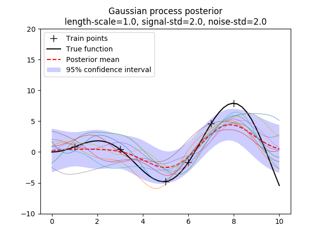

## py-gaussian-process

A handy set of scripts that provide insights into Gaussian Processes by visualizing prior and posterior distributions. Currently, only squared exponential (SE) kernels are provided.

The `interactive_prior.py` sample allows you to play with SE kernel parameters and see the effect on typical functions sampled from a GP prior.

 

`prior.py` samples n-functions from a GP prior using an SE kernel.

 

`posterior.py` uses a Gaussian Process to fit data and visualizes the predicted mean as well as the 95% confidence interval.

 

